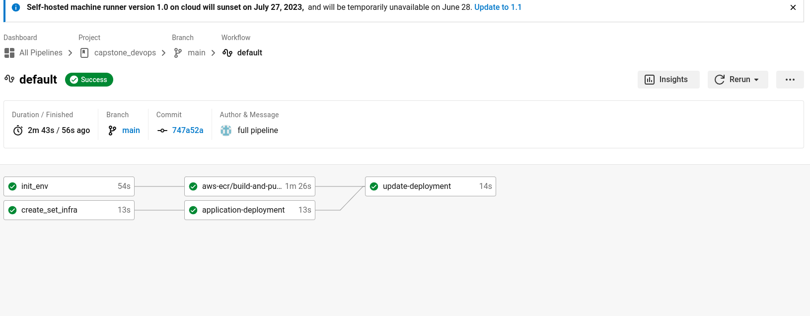
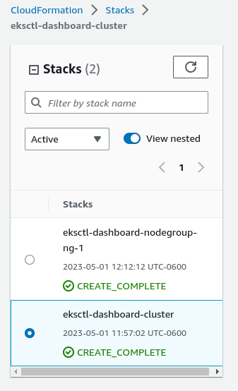
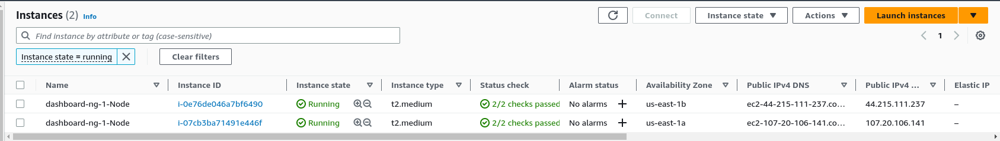
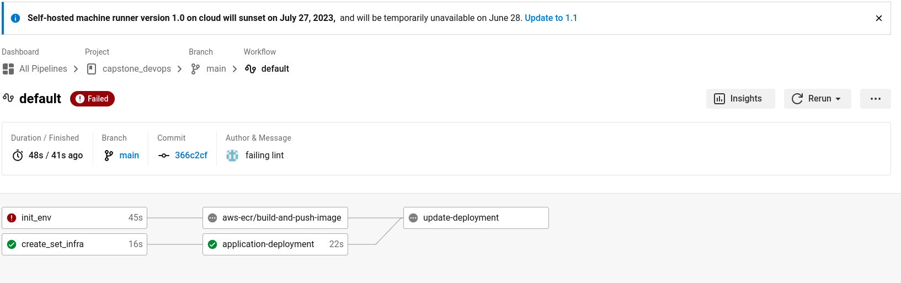
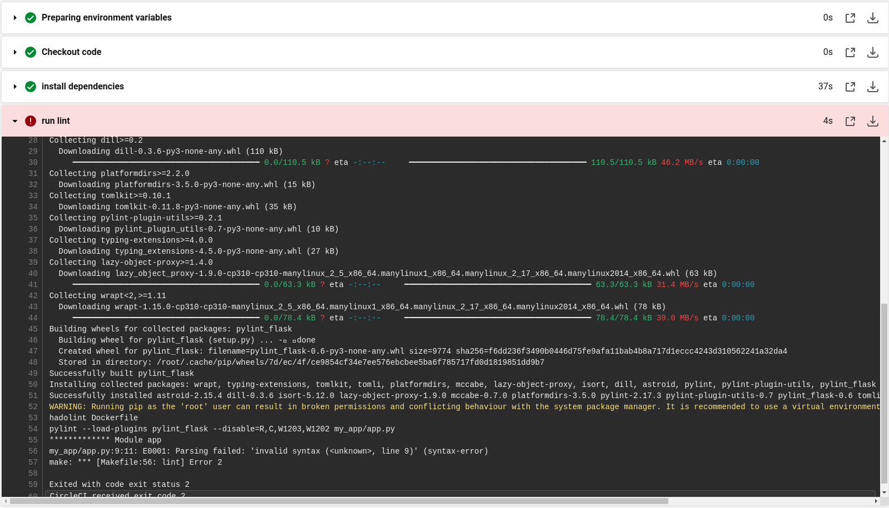
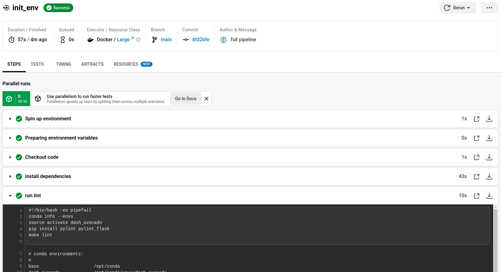
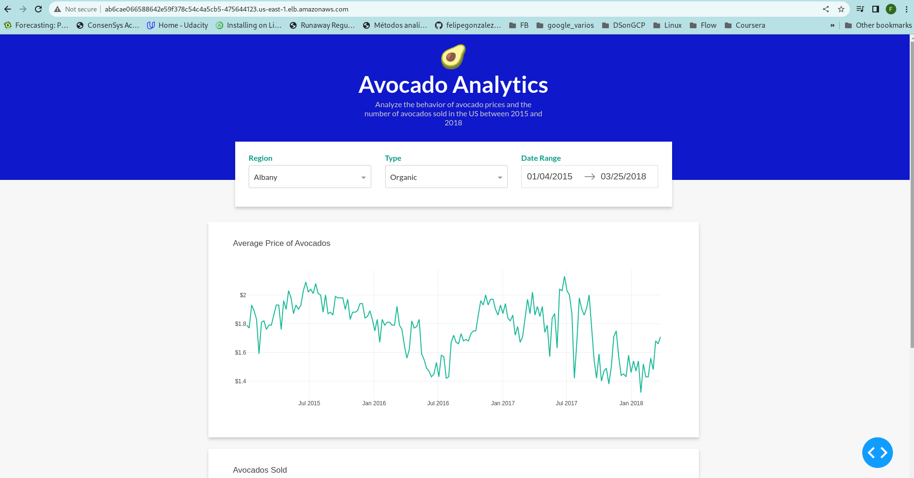
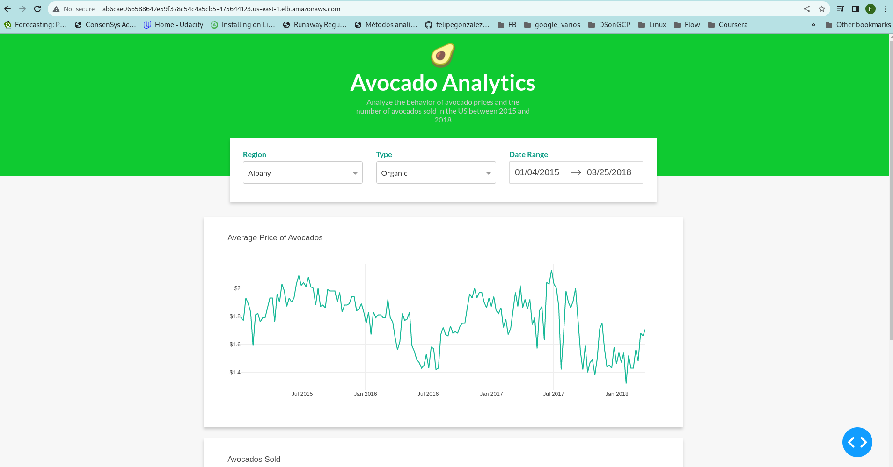

# Cloud DevOps Engineer Capstone Project

In capstone project I make  use of several CI/CD tools and cloud services covered in the program to automate every step in the production line of web application. The application is dahboard that showcases the historical price of the avocado in ths United States, it is built with Plotly-Dash.

Dash-app's original source code at : https://realpython.com/python-dash/#get-started-with-dash-in-python

## Pipeline

In this project, I applied the skills and knowledge I developed throughout the Cloud DevOps Nanodegree program. These include:
- `init_env` : creates an environtment (I used conda instead of venv) just like the one the app uses and performs linting on the application and the dockerfile.
- `create_set_infra` : it provisions the infrastructure for the application, it uses the ektctl and `cluster.yml` manifest to acheive it.
- `application_deployment` : it uses the `deployment_manifest.yml` to configure the depoyment of the application using the image tagged as blue which is the original image that is going to be replaced with the green version.
- `aws-ecr/build-and-push-image`: leveraging the `aws-ecr: circleci/aws-ecr@8.1.3` circleCI's orb, it builds a new image tagged as green using the Dockerfile in the project, then it pushes the results to ECR.
- `update_deployment`: overwrites the existing deployment and update it with the new image

#### Deployed Stacks by ektls on CloudFormation:

#### Deployed Instances:

## Linting

#### Failing output:

#### Succesful lint step output:

## Accessing the Application

### Just right after app deployment

### Just right after app-update

Public LB DNS: http://ab6cae066588642e59f378c54c4a5cb5-475644123.us-east-1.elb.amazonaws.com/

After the last update deployment the service, pods and external-ip can be seen in the screenshot at /screenshots/capstone_ resources.png
